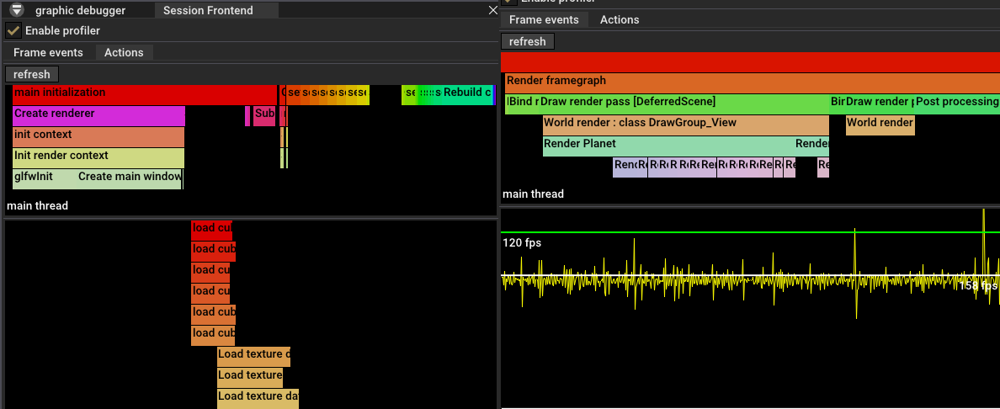
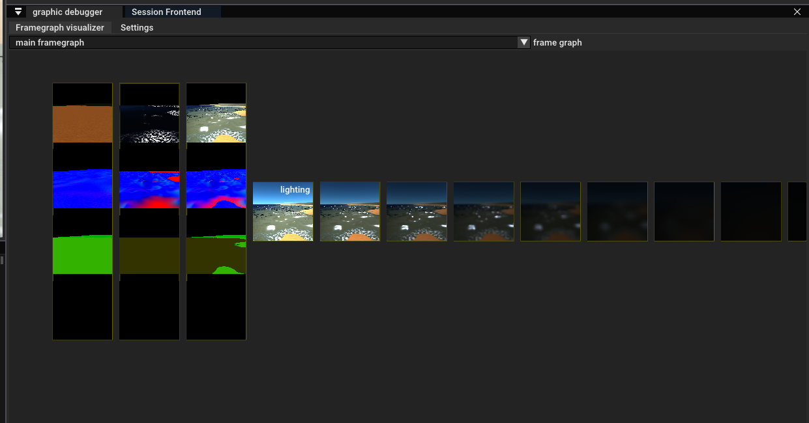
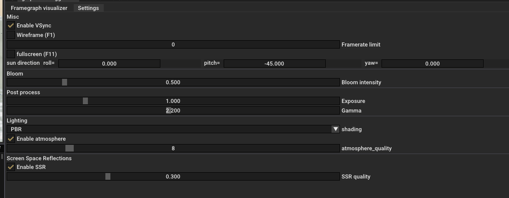
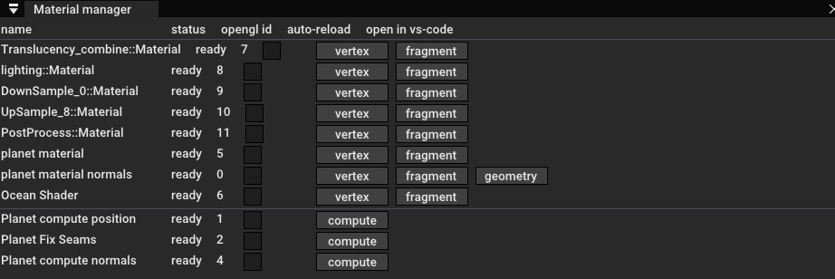

# Projet de programmation graphique

*Par Pierre EVEN*

Lien du repos github : [https://github.com/PierreEVEN/PlanetEngine](https://github.com/PierreEVEN/PlanetEngine)


# Objectif

Au cours de mes précédents projets, j'ai pu traiter la génération procédurale de terrain à de nombreuses reprises sous différents moteurs et architectures. (Unreal Engine 4, [Unity](https://github.com/PierreEVEN/Scuffly), [OpenGL](https://github.com/PierreEVEN/GLEngine), [Three.JS](https://github.com/PierreEVEN/ThreeFlightSimulator) )

Aillant aussi les notions de base sur les shaders et algorithmes vus dans ce 
cours, j'ai voulu pousser le projet plus loins afin de travailler sur de 
nouvelles problématiques que je n'avais jusque-là encore jamais abordé.

Pour ce projet, j'ai donc établis comme objectifs :
- Modélisation d'une planète, et d'un système solaire, du sol jusqu'à l'espace, avec possibilité de naviguer entre différents astres sans transitions.
- Animation des différentes planètes orbitant autour du soleil (+ lunes etc...)
- Précision du maillage de terrain au sol de 1m par vertex comme objectif technique.

On gardera bien entendu les objectifs de base du projet initial qui seront traités en priorité.

# Difficultées techniques prévisibles

## Précisions en virgule flottante.

Au-dessus de quelques km de distance, l'affichage d'une scène pose quelques problèmes de précision dûs au fonctionnement des nombres à virgule flottante, et commence à générer des artéfacts de rendu comme le montre cette [animation](https://www.shadertoy.com/view/4tVyDK).
En pratique, au bout d'à peine 2km de l'origine le phénomène commence à être perceptible, et devient particulièrement problèmatique dès les premières dizaines de km. C'est largement insuffisant pour un système solaire entier même réduit.

La solution la plus simple est d'utiliser des doubles sur 64 bits (fp64) au lieu des float sur 32 bits (fp32). Grace à ça, les problèmes de précision commencent à apparaitre bien plus loins et permettent sans trop de problèmes d'implémenter un système solaire presque complet. (pour les dernières planètes du système solaire, c'est encore un peu léger mais ce sera suffisant dans un premier temps.)

> Pour ce genre de problèmes la solution idéale serait d'utiliser un système de coordonées utilisant des réels à virgule fixe (avec des int). Comme je ne voulais pas trop aller dans l'inconnu, j'ai préféré rester sur de la virgule flottante classique. (ce sera à essayer pour un futur projet)

## Doubles sur GPU

Si les CPU sont très bon pour faire du calcul en fp64 (un peu moins qu'en fp32), les GPU eux sont très mauvais pour ça, voir incapables de le faire pour certaines opérations. Les données devront donc systématiquement rester en fp32 sur GPU.

## Coordonées de texture 2D

Texturer une sphère proprement est très compliqué. Il n'est pas possible de plaquer texture 2D sur une sphère sans avoir de déformations ou d'irrégularités de la densité de pixels à la surface. Il faudra trouver des méthodes pour contrer ce phénomène et faire des compromis.

# Fonctionnement du moteur de rendu

Pour ce projet, se limiter à easycppogl aurait été fastidieux, et peu pratique. J'ai remplacé peu à peu les différentes composantes de la librairie par mes propres éléments graphiques afin de rendre la maintenance et les expérimentations plus simples.

Repartir de presque zéro n'était pas obligatoire, mais cela m'a permis d'avoir un bien meilleur controle sur mon code et m'a fait gagné beaucoup de temps par la suite notament en me permettant de créer des outils intégrés facilitant le débugage. (profileurs, graphes des passes de rendu, visualisation en temps réelle des framebuffers, informations sur les shaders, le système etc...).
Le hot-reload des shaders m'a aussi fait gagné énormément de temps dans leur mise au point.

## Système de matériaux 

[material.h](../src/graphics/material.h), [material.cpp](../src/graphics/material.cpp)

- Rechargement automatiquement du shader sans avoir à relancer le programme.
- Gestion des directives #include, et gestion des erreurs de compilations avec la ligne et le fichier en cause.

## Scene graph 

[scene_component.h](../src/world/scene_component.h), [scene_component.cpp](../src/world/scene_component.cpp)

- Graph de scène on ne peut plus classique.
- Certaines fonctionnalités ne sont pas au point, notamment attacher des 
  objets à d'autre pose problème dans certains cas. Comme je n'en ai pas eu 
  l'usage, j'ai laissé tel quel. Mais il est possible que certaines 
  transformations soient erronées si on sort des cas présentés par la scène 
  d'exemple.

## Render Pass 

- Assemblage simplifié des différentes passes de rendu et automatisation de la création du graph de rendu.
- Permet un débogage avancé et une visualisation détaillée des différentes 
  dépendances entre passes.

> Le framegraph pour ce projet est implémenté dans [renderer_setup.cpp](../src/renderer_setup.cpp)

## Textures

[texture_image.h](../src/graphics/texture_image.h), [texture_image.cpp](../src/graphics/texture_image.cpp)

- Simplification de la création de textures, et permet l'intégration plus facile au reste du moteur de rendu.

# Planètes procédurales

## Caméra et système de coordonnés

Pour contrer les problèmes de précision, la scène sera centrée autour de la caméra avant d'être transmise au GPU afin que la précision soit maximale autour du point de vue. Il faudra donc additionner la translation de la caméra à la matrice "model" de tous les éléments de la scène au lieu de la traiter dans la matrice "vue".

Le calcul de la profondeur dans le depth-buffer sera réalisé en virgule flottante afin d'avoir une distance d'affichage infinie. Pour éviter les problèmes de précision on l'inversera pour avoir les plus petites valeurs au premier plan. [Reversed Depth Buffer](https://www.danielecarbone.com/reverse-depth-buffer-in-opengl/)

## Planètes

### ClipMap

Pouvoir se déplacer librement sur une planète du sol jusqu'à l'espace impose que la densité du maillage soit dynamique. La taille de l'astre ne permet au passage pas de stocker intégralement la carte de hauteur, il faudra faire de la génération procédurale.

Comme méthodes de subdivision, j'ai retenu celle de la [Clipmap](https://developer.nvidia.com/gpugems/gpugems2/part-i-geometric-complexity/chapter-2-terrain-rendering-using-gpu-based-geometry). L'avantage est la légereté au runtime, le nombre de sections est plus faible qu'avec un quadtree, et le problème des trous de couture est légèrement plus simple à résoudre. (c'était aussi une approche que je n'avais jamais essayé).


Le terrain est un emboitement de plusieurs sections ayant à chaque LOD suivant une densité de vertex divisée par 2.


Pour permettre une transition douce entre les différentes couches, 2 des cotés interieurs de chaque section sont plus grands d'une unité. Ainsi il suffit de faire tourner le mesh de 90°, 180° ou 270° pour que le maillage au centre puisse être déplacé d'une unité vers la caméra. En additionnant ce mécanisme sur toutes les couches, il est possible de toujours garder le centre au niveau de la caméra.

Cette approche est loins d'être exempt de défauts : 
- La rotation doit être corrigée et ajoute quelques calculs pour retrouver la position exacte de chaque point.
- Avoir un unique maillage pour chaque section empêche de faire du frustum colling efficacement.

L'idéal aurait été de découper chaque section en rectangles de différentes tailles qu'il suffirait d'intervertir. Je me suis rendu compte de ce défaut trop tard, c'est un aspect à améliorer dans le futur.

### Sphères et planète

Pour le moment, on a un terrain plat infini. Il ne reste plus qu'à le courber en transformant les coordonées XY en coordonées sphériques. On limite ces coordonées à une demi sphère pour éviter au maillage de faire plusieurs fois le "tour" de la planète. Ce placage est réalisé sur GPU dans le vertex shader.


On oriente ensuite cette demi-sphère vers la caméra et le tour est joué.
Pour éviter des phénomènes de glissement du terrain, cette demi-sphere est réorientée à intervalles réguliers.
Cet intervalle est défini par la taille d'une unité du dernier LOD. Cette restriction permet de faire en sorte que la réorientation soit imperceptible au niveau du sol près de la caméra.

> Il y a un défaut à cette approche : comme j'ai fait le choix arbitraire d'utiliser des coordonées sphériques, les angles ne sont plus conservés et le maillage n'est plus une grille 2D régulière. Il est donc possible de distinguer quelques effets de clipping sur les cotés de la sphère. Ce n'est pas non plus très génant, mais ce sera à améliorer par la suite. Au sol cette déformation reste négligeable.

### Shader d'atmosphère

Pour l'atmosphère, j'ai repris et amélioré ce que j'avais réalisé sur [un précédent projet](https://github.com/PierreEVEN/ThreeFlightSimulator). Je m'étais basé à l'époque sur [l'excellente vidéo](https://www.youtube.com/watch?v=DxfEbulyFcY) de Sebastian Lague à ce sujet qui vulgarise très bien le principe et l'implémentation. C'est une approche simple mais qui a plusieurs défauts, notament au niveau de la fidélité du rendu et au niveau du coût en performances. Pour l'instant je n'ai pas eu le temps de me repencher là dessus, mais je compte à l'avenir essayer une approche un peu plus poussée ([Precomputed Atmospheric Scattering](https://ebruneton.github.io/precomputed_atmospheric_scattering/))

### Réflexions et Réfraction

Etant sur une planète, une simple réflexion planaire avec une 2e caméra 
n'aurait pas donné de bons résultats (sur une sphère, ça ne marche pas très 
bien). J'ai donc décidé d'à la place implémenter des [reflexions en Screen Space (SSR)](https://lettier.github.io/3d-game-shaders-for-beginners/screen-space-reflection.html)

Ces reflections permettent de capturer une bonne partie de la scène avec une excellente fidélité, mais certains angles ne sont pas accessibles et seront donc à compléter avec d'autres techniques (cubemap).

La même méthode est appliquée pour la réfraction.

# Interface de l'application

## Raccourcis

- `Esc` : Active / Désactive la navigation du Viewport.
- `F1` : Active / Désactive le mode wireframe.
- `F11` : Active / Désactive le mode plein écran.
- `Z,Q,S,D,Space,Shift` : Navigation
- `F` : Se téléporter au sol sur la planète 

## Session Frontend

Outil permettant de mesurer les temps d'exécution d'un bloc de code

- Mesure d'un évenement arrivant à chaque image : `STAT_FRAME("FrameEvent");`
- Mesure d'un évenement singulier : `STAT_ACTION("OneTimeAction");`

Affichage des résultats en direct dans l'outil "Session Frontend"



## Debugueur Graphique

- Onglet "Framegraph Visualizer"

```
Affichage en live de chaque pass du frame graph
Affichage des dépendances entre les passse.
Affiche du nom des bindings correspondant à l'image fournie par la passe précédente.
Zoom et déplacements avec la molette.
```



- Onglet "Settings"

```
Réglages : 

Mode Wireframe (F1)
Mode plein-écran (F11)
Direction du soleil
Intensité du bloom
Exposition / Gamma
Modèle d'éclairage (PBR / FLAT / Phong)
Qualité de l'atmosphère
Qualité des réflexions
```



## World Outliner

Visualisation du graph de scène.

Double cliquer sur un noeud pour dérouler les enfants.

Drag&drop des noeuds pour réorganiser la hierarchie. (ex : attacher la caméra à un autre objet)

Onglet customisable en overridant la fonction `void draw_ui()` de la class [SceneComponent](../src/world/scene_component.h).


## Material Manager

Liste des shaders chargés dans le moteur.

Cocher "auto-reload" pour activer le rechargement automatique des shaders lorsque le fichier source est modifié.

En cas d'erreur de compilation, l'erreur est affiché dans la colonne "status". Cliquer sur le bouton d'erreur ouvre directement visual studio à la ligne de l'erreur.

Permet également d'ouvrir les shaders dans vscode et de visualiser l'arbre des includes.



## Autre

`Window/Mesh View` : Affichage de la liste des mesh chargés dans le moteur.

`Window/Texture View` : Affichage et visualisation de la liste des textures chargées dans le moteur. 

`Help/System Information` : statistiques et information sur le matériel hote.

`Help/Demo Window` : Fenêtre Demo d'ImGui


# Conclusion

Ce projet m'a permis de pousser mes connaissances et ma maitrise de nombreux aspect du rendu 3D. 
En matière de programmation graphique, j'ai pu expérimenter l'utilisation de compute shaders avec openGL, ainsi que de geometry shaders. J'en ai aussi profité pour faire des expérimentation afin de mieux comprendre le fonctionnement des noises, de l'atmospheric scattering, et des modèles d'éclairages tels que le PBR. J'ai aussi pu faire quelques expérimentations sur les reflections et réfractions en screen-space.

L'objectif initial est globallement atteint : même si la scène de démonstration ne le montre pas, il est possible de créer un système solaire complet à l'échelle 1:1 dans lequel on peut naviguer sans temps de chargements. Il reste tout de même quelques bugs et cas problématique qui font que ce cas de figure n'est pas encore totallement stable. Le maillage du terrain au sol approche les 1m/cell, ce qui était assez compliqué, à obtenir au vu des contraintes techniques (précision f32, taille de la planète etc...)

Texturer une planète de cette taille est un sujet très complexe, et il reste encore de nombreux cas à traiter. Il est donc normal que le shading ait quelques incohérence lorsqu'on s'éloigne de l'origine de la planète. Les normales ont aussi tendance à se décaller progressivement lorsqu'on navigue sur la planète. C'est un bug que j'ai indentifié depuis longtemps, mais qui est assez complexe à résoudre et j'ai du me concentrer sur d'autres priorités.

Le maillage de l'eau n'a pas été optimisé non plus pour des planètes de cette taille, d'où la présence d'un bruit à la surface lorsqu'on s'en rapproche. (toujours le même problème de précision)

Les reflections ne sont pas dans leur état le plus avancé. Celles dans cette version sont légèrement simplifiées.
Elles étaient plus poussées dans ce précédent commit : [https://github.com/PierreEVEN/PlanetEngine/tree/2e939be794f8174d244882255c618e0e70ea6c61](https://github.com/PierreEVEN/PlanetEngine/tree/2e939be794f8174d244882255c618e0e70ea6c61)
(Reflexion de l'atmosphère et skybox par défaut lorsque le rayon tombait en dehors de l'écran).
Cependant, les améliorations apportées par cette ancienne version n'étaient pas assez bénéfiques visuellement pour que je les réimplémentes dans la version actuelle.

Je pensais initiallement aller beaucoup plus loin dans ce projet et commencer à ajouter un peu de végétation, cependant la charge de travail causée par les autres projets + les cours m'ont malheureusement forcé à lever le pied sur celui-ci (Je n'ai pas eu le temps d'y faire d'autres ajouts majeurs depuis début décembre).

Je compte tout de même poursuivre mes expérimentations à l'avenir sur mon projet de moteur que je développe en Rust sous Vulkan.
